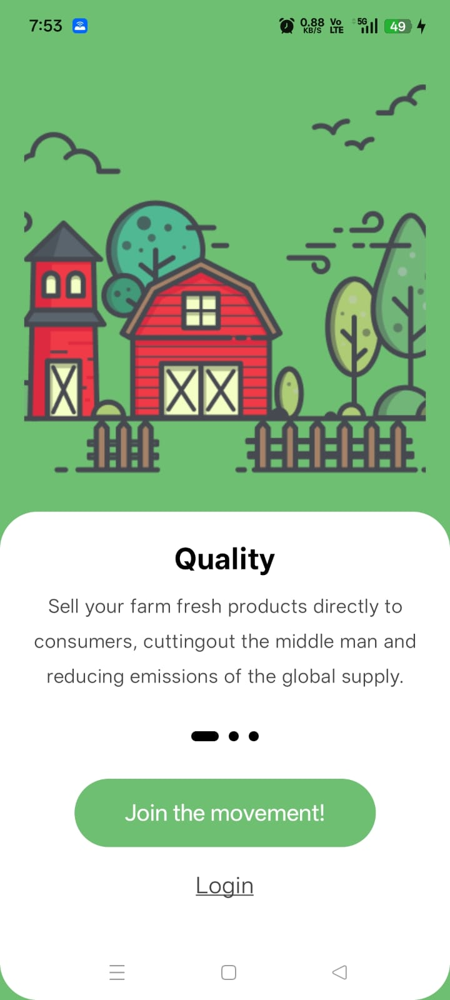
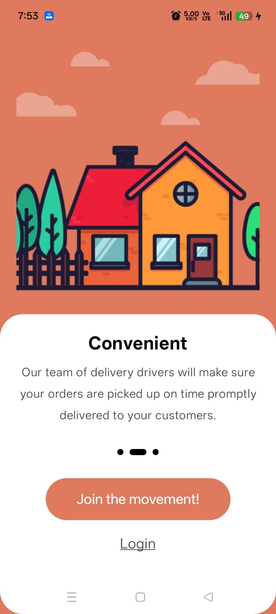
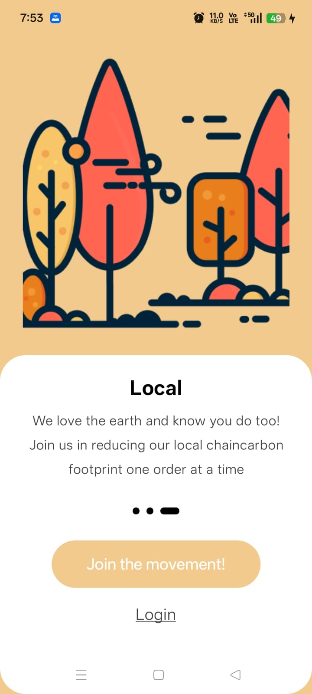
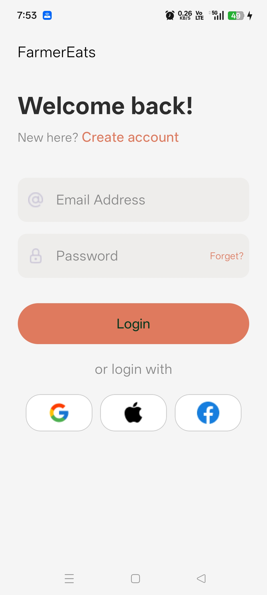
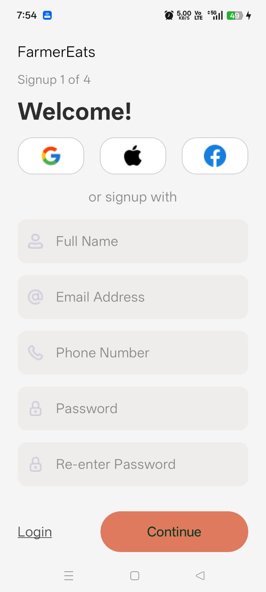
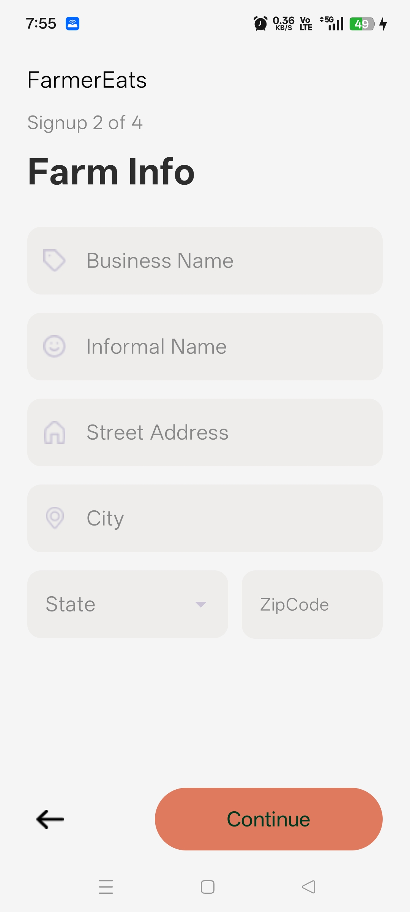
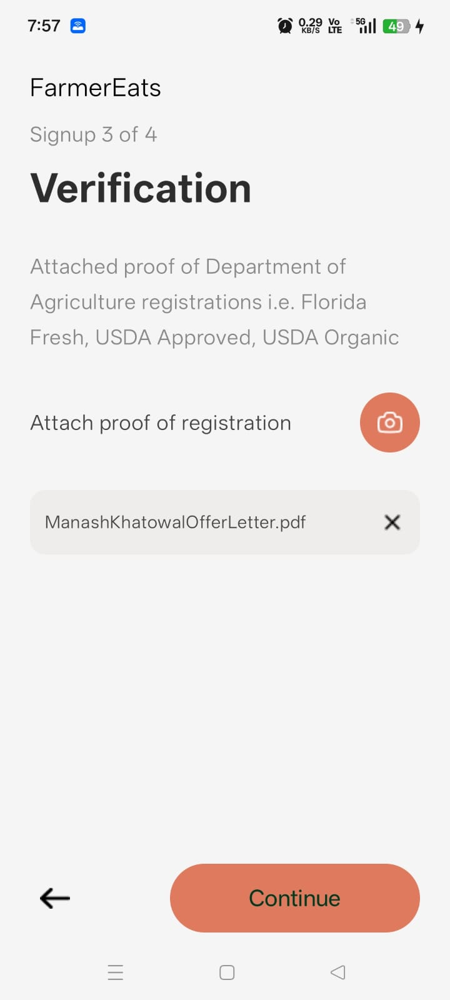
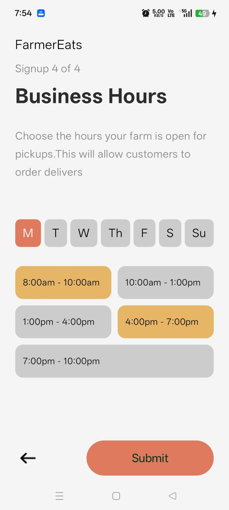
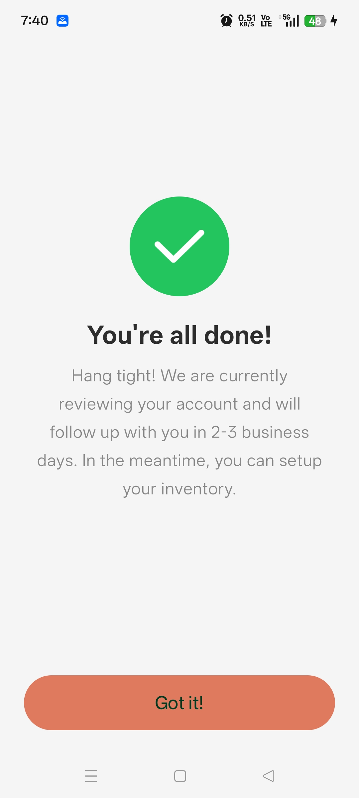

# 🌾 FarmerEats – Farmer Registration App

FarmerEats is an Android application designed to onboard farmers through a **multi-step registration flow**.  
It provides a smooth and modern experience for entering personal details, business information, document verification, and availability setup.

---

## 📱 About the App

FarmerEats simplifies farmer onboarding by providing:

- 🧾 Step-by-step registration flow
- 👤 User profile creation with validation
- 🏪 Business information setup
- 📄 PDF upload for registration proof (Multipart API)
- ⏰ Business hours selection (day-wise slots)
- ✅ Final success confirmation screen
- 🎨 Clean and modern UI using Jetpack Compose

The app is built following modern Android development practices with a focus on **scalability, maintainability, and clean architecture**.

---

## 🛠 Tech Stack

### Language & Core
- Kotlin
- Android SDK

### Architecture
- MVVM (Model–View–ViewModel)
- Clean Architecture principles

### UI
- Jetpack Compose
- Material 3

### Networking
- Retrofit (Multipart API handling)

### State Management
- Compose State + UI State handling

### Other
- Activity Result API (PDF picker)
- URI → File conversion
- Modern Android Jetpack Libraries

---
## 🚀 Onboarding

| Screen 1 | Screen 2 | Screen 3 |
|----------|----------|----------|
|  |  |  |

---

## 🔐 Authentication Screens

| Login | Step1 | Step2 |
|----------|----------|----------|
|  |  |  |

---


## 📄 Verification & Other Screens

|  Step3  |  Step4  | Success |
|----------|----------|----------|
|  | |  |

---


## Demo 


## 🔥 Key Implementations

### 📄 File Upload (PDF)
- Implemented using **Multipart API**
- File picker using Activity Result API
- URI converted to File before upload

---

### ⏰ Business Hours Selection
- Day-wise slot selection UI
- Dynamic state handling in Compose
- Stored using structured `BusinessHours` model

---

### ⚡ Form Validation
- Real-time error handling
- Multi-step validation logic

---

## 🚀 Project Setup (Git Commands)

### 1️⃣ Clone the repository
```bash
git clone https://github.com/Manash396/FarmerEats.git
